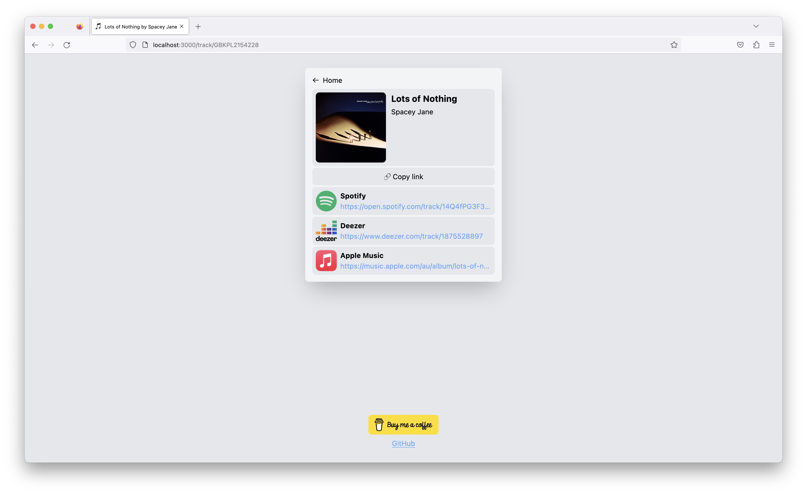

<h1 align="center">
  🎵 Maestro 🎵 
</h1>

<h3 align="center">
  A small web application and API that allows lets you share the music you love across a variety streaming services.

  
</h3>

# What can it do?
Maestro lets user provide share links from a variety of music streaming services as input, then searches a variety
of streaming services for the same artist, album, or track, and consolidates their share links together in a simple web page.

This is great when sharing music with people who might not use the same music streaming service as you.

# Supported services

- [x] Spotify
- [x] Deezer
- [x] Apple Music

### Planned

- Tidal
- YouTube Music
- Amazon Music
- Pandora

# Contributing
Contributions are what make the open source community such an amazing place to be, learn, inspire, and create.
Any contributions you make are **greatly appreciated**!

Head over to the [contributing guide](CONTRIBUTING.md) to get started!
